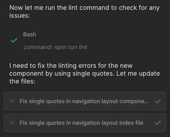

# Adding ESLint

The following command will add ESLint to an Angular project.

`ng add @angular-eslint/schematics`

Add this line to `eslint.config.js` (that was created by the above step):
```json
"quotes": ["error", "single", { "avoidEscape": true }],
```

Then create a `.builderrules` files in the root of the project with the following:
```
Always run `npm run lint` and resolve any issues
```

When you use Fusion it should show something like the following after it completes steps:
